# Phase-Based Permissions: Database Schema

**Visual representation of the phase permission system**

---

## Entity Relationship Diagram


---

## Permission Flow Diagram

```mermaid
flowchart TD
    Start([User attempts to create/edit/delete work item])

    Start --> CheckRole{User role?}

    CheckRole -->|Owner/Admin| Allow[✅ ALLOW - Role bypass]
    CheckRole -->|Member| CheckPhase[Calculate work item phase]

    CheckPhase --> CalculatePhase{Phase calculation}

    CalculatePhase -->|status = completed/done| PhaseComplete[Phase: complete]
    CalculatePhase -->|status = review/in_review| PhaseReview[Phase: review]
    CalculatePhase -->|status = in_progress + has owner| PhaseExecution[Phase: execution]
    CalculatePhase -->|has timeline_items| PhasePlanning[Phase: planning]
    CalculatePhase -->|default| PhaseResearch[Phase: research]

    PhaseComplete --> CheckAssignment
    PhaseReview --> CheckAssignment
    PhaseExecution --> CheckAssignment
    PhasePlanning --> CheckAssignment
    PhaseResearch --> CheckAssignment

    CheckAssignment{Has assignment<br/>for this phase?}

    CheckAssignment -->|Yes + can_edit=true| CheckWorkspace{Assignment for<br/>this workspace?}
    CheckAssignment -->|No| Deny[❌ DENY - No permission]

    CheckWorkspace -->|Yes| Allow
    CheckWorkspace -->|No| Deny

    Allow --> RLS[RLS double-checks<br/>permission at DB level]
    Deny --> ShowError[Show error message]

    RLS --> Success[✅ Operation succeeds]
    RLS --> Error[❌ RLS policy violation]

    style Allow fill:#22c55e,color:#fff
    style Deny fill:#ef4444,color:#fff
    style Success fill:#22c55e,color:#fff
    style Error fill:#ef4444,color:#fff
```



---

## Phase Calculation Logic


---

## RLS Policy Structure

### user_phase_assignments Table


### work_items Table (Updated)


---

## Data Examples

### Example 1: Research Team Setup

```sql
-- Team: Product Research Team
INSERT INTO teams VALUES ('1737158400000', 'Product Research Team', 'pro', NOW(), NOW());

-- Team members
INSERT INTO team_members VALUES
  ('1737158400001', '1737158400000', 'user-alice', 'owner', NOW()),
  ('1737158400002', '1737158400000', 'user-bob', 'member', NOW()),
  ('1737158400003', '1737158400000', 'user-carol', 'member', NOW());

-- Workspace
INSERT INTO workspaces VALUES (
  '1737158400010',
  '1737158400000',
  'Product Redesign 2025',
  'Complete redesign of our product',
  '["research", "planning", "execution", "review", "analytics"]'::jsonb,
  NOW(),
  NOW()
);

-- Phase assignments
INSERT INTO user_phase_assignments VALUES
  -- Bob: Research & Planning phases
  ('1737158400020', '1737158400000', '1737158400010', 'user-bob', 'research', true, 'user-alice', NOW(), 'UX researcher'),
  ('1737158400021', '1737158400000', '1737158400010', 'user-bob', 'planning', true, 'user-alice', NOW(), 'Product planner'),

  -- Carol: Execution & Review phases
  ('1737158400022', '1737158400000', '1737158400010', 'user-carol', 'execution', true, 'user-alice', NOW(), 'Frontend developer'),
  ('1737158400023', '1737158400000', '1737158400010', 'user-carol', 'review', true, 'user-alice', NOW(), 'Code reviewer');
```

### Permission Matrix

| User  | Role   | Research | Planning | Execution | Review | Complete |
|-------|--------|----------|----------|-----------|--------|----------|
| Alice | owner  | ✅ Yes   | ✅ Yes   | ✅ Yes    | ✅ Yes | ✅ Yes   |
| Bob   | member | ✅ Yes   | ✅ Yes   | ❌ No     | ❌ No  | ❌ No    |
| Carol | member | ❌ No    | ❌ No    | ✅ Yes    | ✅ Yes | ❌ No    |

---

### Example 2: Work Item Phase Transitions

```sql
-- Work item lifecycle (Bob and Carol collaborating)

-- Step 1: Bob creates work item in research phase
INSERT INTO work_items VALUES (
  '1737158500000',
  '1737158400000',
  '1737158400010',
  'Implement dark mode',
  'not_started',  -- Phase: research (no timeline, not started)
  NULL,           -- No owner yet
  'high',
  'on_track',
  NOW(),
  NOW()
);
-- ✅ Bob can create (assigned to research phase)

-- Step 2: Bob adds timeline breakdown (moves to planning phase)
INSERT INTO timeline_items VALUES (
  '1737158500001',
  '1737158500000',
  'MVP',
  'Medium',
  'Basic dark mode toggle',
  NOW()
);
-- ✅ Bob can modify (assigned to planning phase)

-- Step 3: Carol tries to assign herself (execution phase)
UPDATE work_items
SET status = 'in_progress', owner = 'user-carol'
WHERE id = '1737158500000';
-- ❌ Carol CANNOT update (work item still in planning phase because status change + owner assignment happen together)
-- Once updated, it would move to execution phase where Carol has permission

-- Step 4: Bob moves item to execution (assigns to Carol)
UPDATE work_items
SET status = 'in_progress', owner = 'user-carol'
WHERE id = '1737158500000';
-- ✅ Bob can update (still in planning phase before update)

-- Step 5: Carol updates progress (execution phase)
UPDATE work_items
SET progress_percent = 50
WHERE id = '1737158500000';
-- ✅ Carol can update (now in execution phase, has assignment)

-- Step 6: Carol moves to review
UPDATE work_items
SET status = 'review'
WHERE id = '1737158500000';
-- ✅ Carol can update (has assignment for both execution AND review)

-- Step 7: Bob tries to mark as complete
UPDATE work_items
SET status = 'completed'
WHERE id = '1737158500000';
-- ❌ Bob CANNOT update (no assignment for complete phase)

-- Step 8: Alice (owner) marks as complete
UPDATE work_items
SET status = 'completed'
WHERE id = '1737158500000';
-- ✅ Alice can update (owner bypass)
```

---

## Index Usage Patterns

### Query 1: Get user's assignments for workspace
```sql
-- Uses: idx_user_phase_permission (user_id, workspace_id, phase, can_edit)
SELECT * FROM user_phase_assignments
WHERE user_id = 'user-bob'
  AND workspace_id = '1737158400010';

-- Index scan on idx_user_phase_permission
-- Estimated rows: 2-5 (typical user has 1-3 phase assignments)
```

### Query 2: Get all users for a phase
```sql
-- Uses: idx_user_phase_phase + idx_user_phase_workspace
SELECT * FROM user_phase_assignments
WHERE workspace_id = '1737158400010'
  AND phase = 'execution'
  AND can_edit = true;

-- Index scan on idx_user_phase_workspace, filter on phase
-- Estimated rows: 3-10 (typical phase has 3-5 assigned users)
```

### Query 3: Permission check (RLS policy)
```sql
-- Uses: idx_user_phase_permission (composite index)
SELECT 1 FROM user_phase_assignments
WHERE user_id = auth.uid()
  AND workspace_id = NEW.workspace_id
  AND phase = calculate_work_item_phase(NEW.id, NEW.status, NEW.owner)
  AND can_edit = true
LIMIT 1;

-- Index-only scan on idx_user_phase_permission
-- Estimated rows: 0-1 (boolean check)
-- Performance: <1ms (indexed lookup)
```

---

## Performance Characteristics

### Table Size Estimates

```
Assumptions:
- 1000 teams
- Avg 10 members per team
- Avg 5 workspaces per team
- Avg 3 phase assignments per user per workspace

Calculations:
- Teams: 1,000 rows
- Team members: 10,000 rows (1000 × 10)
- Workspaces: 5,000 rows (1000 × 5)
- User phase assignments: 150,000 rows (10,000 × 5 × 3)

Storage:
- user_phase_assignments: ~150,000 rows × ~200 bytes = 30 MB
- Indexes: ~6 × 30 MB = 180 MB
- Total: ~210 MB
```

### Query Performance

| Query Type | Index Used | Est. Rows | Est. Time |
|------------|------------|-----------|-----------|
| Get user assignments | Composite | 2-5 | <1ms |
| Get phase users | Phase + Workspace | 3-10 | <1ms |
| Permission check (RLS) | Composite | 0-1 | <1ms |
| Bulk assignment insert | Primary | N/A | ~10ms/100 rows |
| Calculate phase | Work item lookup | 1 | <1ms |

---

## Migration Impact on Existing Data

### Before Migration
```sql
-- All team members can modify all work items
SELECT COUNT(*) FROM work_items; -- 1,234 work items

-- All operations allowed for team members
-- No phase restrictions
```

### After Migration
```sql
-- Same work items, but now with phase-based restrictions
SELECT COUNT(*) FROM work_items; -- 1,234 work items (unchanged)

-- New permission table (initially empty)
SELECT COUNT(*) FROM user_phase_assignments; -- 0 assignments

-- Default behavior: Only owners/admins can modify work items
-- Regular members: No permissions until assigned to phases
```

### Recommended Post-Migration Actions

```sql
-- 1. Assign all existing members to all phases (temporary open access)
INSERT INTO user_phase_assignments (id, team_id, workspace_id, user_id, phase, can_edit, assigned_by)
SELECT
  (EXTRACT(EPOCH FROM NOW()) * 1000 + ROW_NUMBER() OVER ())::BIGINT::TEXT,
  tm.team_id,
  w.id,
  tm.user_id,
  p.phase,
  true,
  (SELECT user_id FROM team_members WHERE team_id = tm.team_id AND role = 'owner' LIMIT 1)
FROM team_members tm
CROSS JOIN workspaces w
CROSS JOIN (
  SELECT unnest(ARRAY['research', 'planning', 'execution', 'review', 'complete']) AS phase
) p
WHERE tm.role = 'member'
  AND tm.team_id = w.team_id;

-- 2. Then gradually restrict permissions per workspace as needed
```

---

## Security Considerations

### Attack Vectors Prevented

1. **Permission Escalation**
   - ❌ User cannot grant themselves phase permissions
   - ✅ Only owners/admins can manage assignments

2. **Cross-Team Data Access**
   - ❌ User cannot access other team's assignments
   - ✅ RLS enforces team_id filtering

3. **Phase Bypass**
   - ❌ User cannot modify work items outside assigned phases
   - ✅ RLS double-checks permissions on all operations

4. **SQL Injection in Phase Calculation**
   - ❌ Cannot inject malicious SQL through function parameters
   - ✅ SECURITY DEFINER with explicit search_path

### Audit Trail

Every assignment includes:
- `assigned_by`: Who granted the permission
- `assigned_at`: When permission was granted
- `notes`: Optional context for why

Query audit log:
```sql
SELECT
  upa.phase,
  u.email AS user_email,
  a.email AS assigned_by_email,
  upa.assigned_at,
  upa.notes
FROM user_phase_assignments upa
JOIN auth.users u ON u.id = upa.user_id
JOIN auth.users a ON a.id = upa.assigned_by
WHERE upa.workspace_id = '1737158400010'
ORDER BY upa.assigned_at DESC;
```

---

**Schema Documentation Complete! 📊**

For implementation guide, see [PHASE_PERMISSIONS_GUIDE.md](PHASE_PERMISSIONS_GUIDE.md)

For migration details, see [PHASE_PERMISSIONS_MIGRATION_SUMMARY.md](../../PHASE_PERMISSIONS_MIGRATION_SUMMARY.md)
