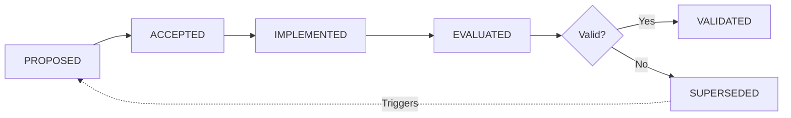

# Research & Decisions Hub

**Last Updated**: 2025-12-01
**Purpose**: Central index for all research findings, architectural decisions, and UX patterns

Use this hub to:
- Understand **WHY** decisions were made
- Question or revisit decisions with full context
- Find research backing for implementation choices
- Avoid reinventing solutions already researched

---

## 📦 Folder Structure (Reorganized 2025-12-01)

Research is organized into **subfolders** for better discoverability:

```
docs/research/
├── README.md                          # This index file
├── DECISION_INDEX.md                  # Master decision log
├── architecture-decisions/            # ADRs (Architectural Decision Records)
│   ├── linear-architecture.md         # Team-scoped items, Departments
│   ├── scope-decisions.md             # Native vs Integration boundary
│   └── ux-design-decisions.md         # Templates, Visual alignment
├── core-research/                     # Comprehensive research (consolidated)
│   ├── progressive-disclosure-ux.md   # UX patterns, in-app guidance
│   ├── cross-team-collaboration.md    # Team config, field templates
│   ├── product-strategy-alignment.md  # PM landscape, OKR patterns
│   └── ultra-deep-research-findings.md # Handoffs, RBAC, experimentation
└── supporting-research/               # Topic-specific research
    ├── customization-patterns.md      # Configuration design
    ├── dashboard-design.md            # Dashboard UX
    ├── flexibility-vs-simplicity.md   # Balance framework
    └── onboarding-workflows.md        # Onboarding patterns
```

**Consolidation Note** (2025-12-01): Content from `customer-experience-research-findings.md` was merged into core-research files and the original deleted to reduce duplication.

---

## Quick Navigation

### 📋 Decision Index
**[DECISION_INDEX.md](DECISION_INDEX.md)** - Master log of all decisions with status, dates, and review triggers

### 🏗️ Architecture Decisions (ADRs)
| Document | Key Decisions | Status |
|----------|---------------|--------|
| [linear-architecture.md](architecture-decisions/linear-architecture.md) | Team-scoped items, Departments, Triage workflow | ✅ Accepted |
| [scope-decisions.md](architecture-decisions/scope-decisions.md) | Native vs Integration boundary, phase sequencing | ✅ Accepted |
| [ux-design-decisions.md](architecture-decisions/ux-design-decisions.md) | Templates, Contextual menus, Visual alignment | ✅ Accepted |

### 📊 Research Findings

**Core Research (Comprehensive)** → `core-research/`
| Document | Topic | Key Insight |
|----------|-------|-------------|
| [progressive-disclosure-ux.md](core-research/progressive-disclosure-ux.md) | **UX Patterns & CX** | Progressive disclosure, in-app guidance, validation, empty states, industry leader patterns |
| [cross-team-collaboration.md](core-research/cross-team-collaboration.md) | **Team Configuration** | Multi-team contexts, field templates, connection types, unified dashboards |
| [product-strategy-alignment.md](core-research/product-strategy-alignment.md) | **Strategy Layer** | OKR alignment, PM tool landscape, prioritization frameworks, AI suggestions |
| [ultra-deep-research-findings.md](core-research/ultra-deep-research-findings.md) | **Advanced Patterns** | Integration handoffs, RBAC governance, B2B experimentation, add vs simplify |

**Supporting Research** → `supporting-research/`
| Document | Topic | Key Insight |
|----------|-------|-------------|
| [customization-patterns.md](supporting-research/customization-patterns.md) | Configuration design | 7 cost categories, over-customization risks |
| [dashboard-design.md](supporting-research/dashboard-design.md) | Dashboard UX | 6-step design process, role-based layouts |
| [onboarding-workflows.md](supporting-research/onboarding-workflows.md) | Onboarding patterns | 10 automation best practices, team handoff |
| [flexibility-vs-simplicity.md](supporting-research/flexibility-vs-simplicity.md) | Balance framework | When to add/remove options decision tree |

---

## Key Statistics (Quick Reference)

### Business Impact
| Statistic | Source | Used In |
|-----------|--------|---------|
| **$100** return per $1 UX investment | Forrester Research | Priority justification |
| **2,600%** ROI from design systems | IBM Carbon Study | Design system value |
| **67%** abandon on poor UX | UXPin Research | UX priority |
| **50%** dev time reduction with design systems | Multiple sources | shadcn/ui choice |

### User Behavior
| Statistic | Source | Used In |
|-----------|--------|---------|
| **52%** adoption improvement (role-based UI) | Enterprise PM study | UX-004 Progressive disclosure |
| **75%** new users churn in first week | AnnounceKit | Onboarding priority |
| **90%** form completion with on-blur validation | Baymard Institute | UX-005 Validation pattern |
| **25-87%** support ticket reduction (resource centers) | Userpilot | In-app guidance value |

### Team Collaboration
| Statistic | Source | Used In |
|-----------|--------|---------|
| **75%** cross-functional teams dysfunctional | HBR Research | ADR-001 Team structure |
| **30%** reduction in design cycles | Shopify Polaris | Design-dev handoff |

---

## Decision Lifecycle



### Status Definitions
- **PROPOSED**: Under discussion, alternatives being evaluated
- **ACCEPTED**: Approved for implementation
- **IMPLEMENTED**: Decision has been coded/deployed
- **EVALUATED**: Post-implementation assessment complete
- **VALIDATED**: Confirmed as correct choice
- **SUPERSEDED**: Replaced by new decision (with audit trail)

---

## How to Use This Research

### For Implementation
**Before coding any feature:**
1. Check relevant research file for proven patterns
2. Reference statistics when justifying choices
3. Follow recommended UX patterns (validation, disclosure, etc.)
4. Link to research in PR/commit message

**Example**: Implementing role switcher → Read [progressive-disclosure-ux.md](core-research/progressive-disclosure-ux.md)

### For Decision Review
**When questioning an existing decision:**
1. Find decision in [DECISION_INDEX.md](DECISION_INDEX.md)
2. Read linked document for full context + alternatives considered
3. Check "Review Triggers" section
4. If triggered, gather new data and propose update

**Example**: "Why no Slack integration?" → See [scope-decisions.md](architecture-decisions/scope-decisions.md) ADR-002

### For Adding New Decisions
**When making a new architectural or UX decision:**
1. Create research document with findings (use template below)
2. Add entry to [DECISION_INDEX.md](DECISION_INDEX.md)
3. Cross-link from this README
4. Set clear review triggers (time-based or metric-based)

**Template**: See "Decision Records Format" below

### For Challenging Assumptions
**If you think a decision is wrong:**
1. Read the original research + rationale
2. Identify what changed (new data, tech, user feedback)
3. Propose alternative with supporting research
4. Update decision status to PROPOSED → discuss → SUPERSEDED

**Remember**: Decisions have context. Don't just reject—understand first.

---

## Research Categories

### 1. User Experience Patterns
**Primary File**: [progressive-disclosure-ux.md](core-research/progressive-disclosure-ux.md) *(consolidated)*

- Progressive disclosure (3 levels: Basic → Intermediate → Advanced)
- Role-based interface design (PM vs Designer vs Developer)
- 8 types of in-app guidance (tooltips, walkthroughs, checklists, etc.)
- Validation patterns (on-blur recommended over on-submit)
- Empty state design principles
- Industry leader analysis (Linear, Notion, Figma, Productboard, Asana)

### 2. Cross-Team Collaboration
**Primary File**: [cross-team-collaboration.md](core-research/cross-team-collaboration.md) *(consolidated)*
**Architecture**: [linear-architecture.md](architecture-decisions/linear-architecture.md)

- Why 75% of cross-functional teams fail
- One work item, multiple team contexts (Product, Engineering, Design, Marketing, Sales, Support)
- Team-specific field templates (5 departments with custom fields)
- Cross-team connection types (12 types including marketing_for, design_for, qa_for)
- Team-specific views (Board, Timeline, Tracker)
- Unified cross-team alignment dashboard
- Database schema for team configurations

### 3. Product Configuration
**Files**: [customization-patterns.md](supporting-research/customization-patterns.md), [flexibility-vs-simplicity.md](supporting-research/flexibility-vs-simplicity.md)

- Customization trap and 7 cost categories
- When to add options vs simplify (decision tree)
- Smart defaults strategy
- Template + customization approach

### 4. Dashboard & Analytics
**Files**: [dashboard-design.md](supporting-research/dashboard-design.md)

- Dashboard types by user role (Exec vs PM vs Dev)
- 6-step thoughtful dashboard design process
- KPI selection methodology
- Layout and flow optimization

### 5. Onboarding & Workflows
**Files**: [onboarding-workflows.md](supporting-research/onboarding-workflows.md)

- Team handoff best practices
- Workflow automation principles
- Design-to-development handoff
- Onboarding checklist patterns

### 6. Product Strategy
**Primary File**: [product-strategy-alignment.md](core-research/product-strategy-alignment.md) *(comprehensive)*

- PM tool landscape analysis (Productboard, Linear, Jira positioning)
- Full product lifecycle stages (8 stages from Ideation to Feedback Loop)
- OKR connection patterns and strategy embedding
- AI-powered pillar suggestions with confidence scoring
- Alignment enforcement models (Off, Suggest, Require)
- Strategic pillars data model and UI patterns

### 7. Advanced Patterns (Unique Findings)
**File**: [ultra-deep-research-findings.md](core-research/ultra-deep-research-findings.md) *(trimmed to unique content)*

- Integration & cross-team handoffs (Design → Engineering workflow)
- Team customization governance (RBAC, permission bundles, templates)
- B2B experimentation approaches (A/B testing, feature flags, CUPED)
- Add vs simplify decision framework

---

## Decision Records Format

All architectural and UX decisions are documented as **ADRs (Architectural Decision Records)** with this structure:

### Required Sections
| Section | Purpose | Example |
|---------|---------|---------|
| **Context** | What situation prompted this decision? | "Users confused by unified task list mixing team types" |
| **Decision** | What did we decide? | "Implement department filtering with icon badges" |
| **Rationale** | Why this choice over alternatives? | "Linear's approach proven at scale, 75% teams need structure" |
| **Alternatives Considered** | What options were evaluated? | "1. Unified list 2. Separate workspaces 3. Department filter (chosen)" |
| **Consequences** | Positive, negative, and risks | "+: Reduces clutter -: Adds config step Risks: Over-categorization" |
| **Review Triggers** | When should we reconsider? | "If >30% users disable departments OR competitor launches better solution" |

### Optional Sections
- **Implementation Notes**: How to code this decision
- **Metrics to Track**: KPIs that validate/invalidate decision
- **Related Decisions**: Cross-links to dependent ADRs

---

## Ultra Deep Research Tasks

The following **Parallel AI Ultra-tier** research tasks were completed with comprehensive analysis:

| Task ID | Topic | Status | Consolidated To |
|---------|-------|--------|-----------------|
| `trun_2e10e9ca...1303439` | Cross-team alignment in PM tools | ✅ Complete | [product-strategy-alignment.md](core-research/product-strategy-alignment.md) |
| `trun_2e10e9ca...a79d8d` | UX complexity management | ✅ Complete | [progressive-disclosure-ux.md](core-research/progressive-disclosure-ux.md) |
| `trun_2e10e9ca...aa8ac0` | Team-specific workflow requirements | ✅ Complete | [cross-team-collaboration.md](core-research/cross-team-collaboration.md) |
| `trun_2e10e9ca...248f9ed` | Product strategy alignment | ✅ Complete | [product-strategy-alignment.md](core-research/product-strategy-alignment.md) |

**Unique findings retained in**: [ultra-deep-research-findings.md](core-research/ultra-deep-research-findings.md) (Parts 3, 5, 6, 7 only)

> **Note**: Research was consolidated on 2025-12-01 to reduce duplication. Cross-team alignment and product strategy findings were merged into their respective primary documents. Ultra-deep now contains only unique content: integration handoffs, RBAC governance, B2B experimentation, and add vs simplify framework.

---

## Related Documentation

### Planning & Implementation
- **[docs/planning/MASTER_IMPLEMENTATION_ROADMAP.md](../planning/MASTER_IMPLEMENTATION_ROADMAP.md)** - Sequencing and dependencies
- **[docs/implementation/README.md](../implementation/README.md)** - Week-by-week progress
- **[docs/planning/PROGRESS.md](../planning/PROGRESS.md)** - Current status tracker

### Postponed Features
- **[docs/postponed/README.md](../postponed/README.md)** - Features waiting for implementation
- Many postponed features reference research from this directory

---

## Contributing New Research

### When to Add Research
Add new research documents when:
1. Making architectural decisions (ADR)
2. Evaluating UX patterns with competitive analysis
3. Choosing between technology alternatives
4. Establishing team processes or conventions
5. Learning from post-mortems or incidents

### Research Document Template
```markdown
# [Topic] Research

**Date**: YYYY-MM-DD
**Researcher**: [Name/Team]
**Purpose**: [Why this research was needed]

## Key Findings
[Bullet points of main takeaways]

## Data Sources
[List of tools, studies, competitive analysis]

## Recommendations
[Actionable next steps]

## Statistics
| Statistic | Source | Confidence |
|-----------|--------|------------|

## Review Triggers
[When to revisit this research]
```

### After Adding Research
1. Update [DECISION_INDEX.md](DECISION_INDEX.md) if it's a decision
2. Add row to relevant table in this README
3. Cross-link from related docs (implementation weeks, postponed features)
4. Update "Last Updated" date at top of this file

---

## Maintenance Schedule

| Frequency | Action |
|-----------|--------|
| **Weekly** | Review new decisions added to DECISION_INDEX.md |
| **Monthly** | Check review triggers for accepted decisions |
| **Quarterly** | Audit for superseded decisions, update statistics |
| **Annually** | Archive old research, consolidate learnings |

**Last Audit**: 2025-12-01

---

**Ready to research! 🔍**

For questions about using this hub, see the process guides in [docs/processes/](../processes/) or ask the team.
